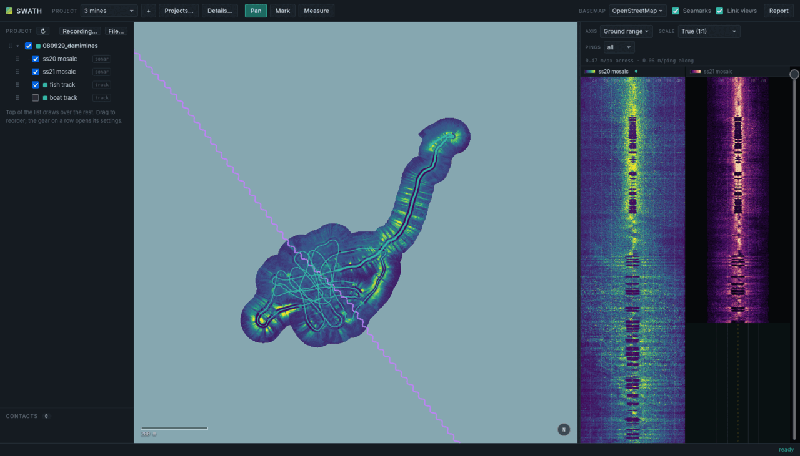
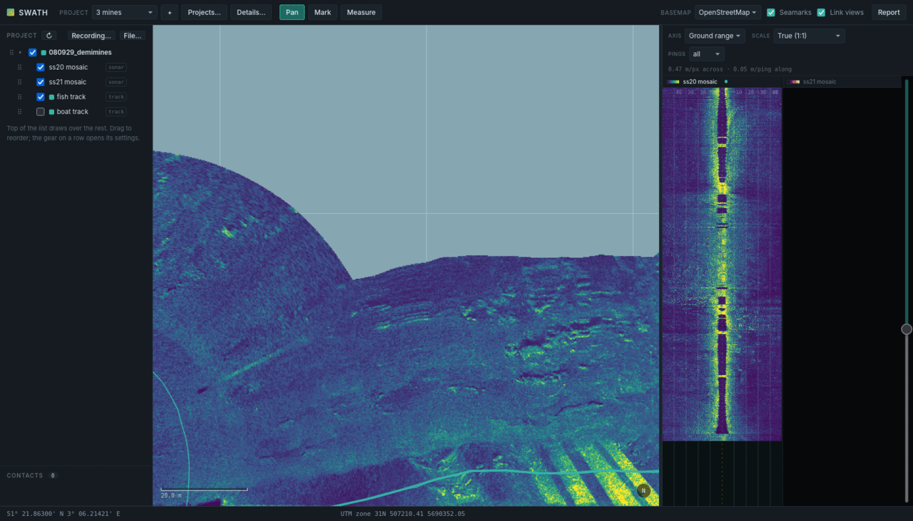
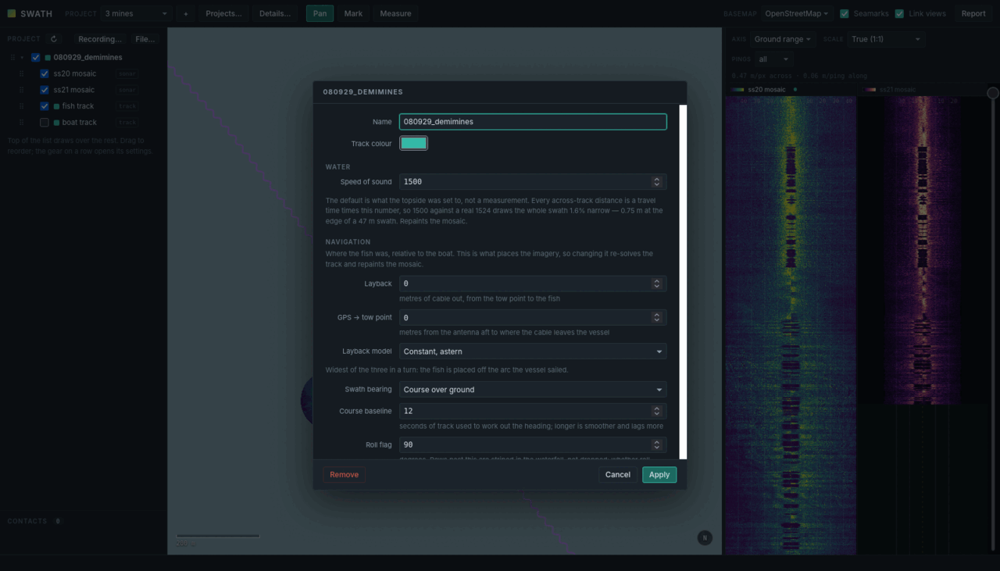
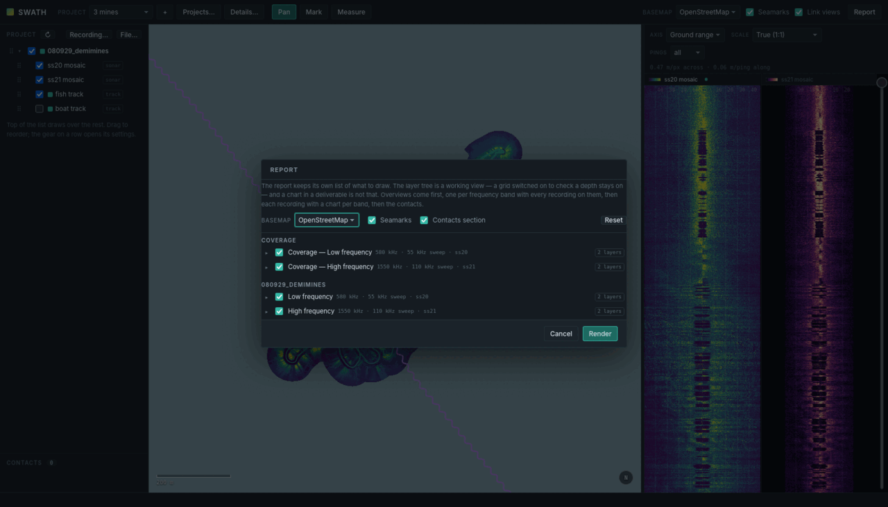

# swath

A sidescan sonar survey viewer, in Rust.

Load a day's recordings, see where the boat went and where the towfish actually
was, read the waterfall and the georeferenced mosaic side by side, and mark a
contact from either one so it lands in the same place on both. Then hand out a
report with the positions in whatever coordinate systems the client asked for.

It also plans the next day: give it the positions to search and the sonar to
search with, and it lays out the lines, the turns between them and the coverage
they buy, then writes a GPX for every azimuth in the quadrant — so the choice of
which way to run is made on the day, against the sea you actually got.

It reads EdgeTech JSF and XTF, imports GeoTIFF grids and GPX, and runs as a
local web app or a desktop window. There is no build step for the frontend and
no C library underneath: `cargo build` is the whole install, and on Windows the
result is one self-contained `swath.exe`.



*One recording, both frequency bands. The chart carries the mosaic and the
fish's own track; the waterfall shows a pane per band — 580 kHz on the left,
1550 kHz on the right — over the same rows of the same seabed. The layer panel
is the draw order, top first.*

---

## Build

```sh
cargo build --release        # the library and the `swath` command
```

That is the whole browser version, and it needs nothing outside the crates.io
graph — no GDAL, no PROJ, no system library at all.

The frontend is carried inside the executable: swath-core's build script walks
`ui/` and compiles it in, so a release binary is one file with no assets to
install beside it and no way to end up running one version's code against
another version's frontend. A `ui/` directory found next to the binary still
wins when there is one, and `--ui DIR` names one outright, so editing the
frontend in a checkout works exactly as before — save, reload, done.

The desktop shell is deliberately **not** in that build. It links webkit2gtk,
which cannot be installed everywhere, and discovering that on the first command
in a README is a poor introduction — so it is opt-in. Where the `-dev` packages
cannot go in system-wide, `scripts/build-env.sh` points the build at a
user-owned sysroot:

```sh
source scripts/build-env.sh
cargo build --release -p swath-app
```

### Windows

[`.github/workflows/windows.yml`](.github/workflows/windows.yml) builds
`swath.exe` for x86_64 on every push and attaches it to the release on a tag.
It is a single self-contained file: the CRT is linked statically, so there is
no redistributable to chase, and the frontend is inside it, so there is no
folder to keep beside it. Drop it in the workspace folder and double-click —
with no arguments `swath` starts the server on a free port, opens a browser at
it, and takes the folder it was started from as the workspace.

Building one by hand, on Windows:

```sh
set RUSTFLAGS=-C target-feature=+crt-static
cargo build --release -p swath-cli --target x86_64-pc-windows-msvc
```

Cross-building from Linux also works — `rustup target add x86_64-pc-windows-gnu`
and a mingw-w64 linker, or `cargo-xwin` for the MSVC target — but CI is less
trouble, and it runs the test suite on Windows while it is there, which is the
only place the path handling and the directory-symlink branch get exercised.

## The workspace

**swath works on a folder, and that folder is not the source tree.** A
workspace holds three directories, and the app fills in the last two itself:

```
data/<recording>/*.jsf     the recordings, untouched — you put these here
out/<recording>/           everything derived from them, rebuildable
projects/<name>/           the jobs: contacts, layer stacks, report settings,
                           and the search plans written out of exports/
```

Point the app at one with `--root`, or just start it from inside:

```sh
cd /path/to/workspace
/path/to/swath/target/release/swath serve --port 8731    # http://127.0.0.1:8731/
/path/to/swath/target/release/swath-app                  # the same, in a window
```

Both start the same server and serve the same frontend; the shell is a window
around it. The port is optional — without one the kernel picks it and the
server says which, along with the two paths it decided on:

```
swath 0.1.0 — http://127.0.0.1:8731/
  workspace: /path/to/workspace
  frontend:  /path/to/swath/ui
```

**Read those two lines when something is missing.** A viewer that comes up
looking perfectly healthy and completely empty is almost always a workspace
pointed one directory off — there is nothing in it, and nothing about that
looks broken.

### On the network

It listens on loopback only. `--host 0.0.0.0` lets other machines in — a second
laptop on the boat's wifi, a tablet at the helm — and the banner then prints the
address to type over there, picked off the routing table rather than the
interface list so it is the one that actually carries traffic:

```sh
swath serve --host 0.0.0.0 --port 8731
```

```
swath 0.1.0 — http://127.0.0.1:8731/
  workspace: /path/to/workspace
  frontend:  built in, 11 files
  network:   http://172.16.60.18:8731/
             no password -- whoever reaches it can change the workspace
```

That last line is the whole security model: there is none. Anything the viewer
can do, a browser on that network can do — rename a project, delete a recording,
open a report on this machine's desktop. Do it on a network you control, and
open the port to that subnet rather than to everything:

```sh
sudo ufw allow from 192.168.1.0/24 to any port 8731 proto tcp
```

`scripts/restart.sh` takes the same choice as `HOST=0.0.0.0`, and leaves it out
by default for the same reason.

## First run

1. **Add a recording.** *Recording…* in the left panel takes a folder from
   anywhere on the machine — the survey drive, a share, `data/` — as a copy, a
   move, or a link that leaves the files where they are.
2. **Wait.** Indexing and mosaicking start on their own, in the background. The
   layer row says `building…` and reports a failure rather than quietly
   switching itself off.
3. **Look.** Tick a mosaic to put it on the chart. Tick two and the waterfall
   shows both bands over the same seabed, sharing rows and scroll.
4. **Mark contacts.** `M`, then click, on the chart or the waterfall. Either
   way it lands in the same place on both, carrying the water depth and fish
   altitude at that spot and a sonar snapshot taken as it was marked. Extent is
   recorded when you draw one, and left empty when you do not.
5. **Report.** *Report* opens the outline, asks which layers each chart should
   carry, and renders HTML with a print stylesheet. "Export PDF" is the
   browser's own print-to-file.



*Zoomed to a 20 m scale bar: ripples, and the fish's own track laid across
them. The status bar reads the cursor out in WGS 84 and in the project's grid
at once — here UTM zone 31N — because a position that has to go in a report is
worth reading without a conversion step.*

Nothing above needs the command line. It is all there when you want it:

```sh
swath index <recording>                   # build the ping index
swath mosaic <recording> [--subsystem 20] # build the georeferenced mosaic
swath layer <file.tif|file.gpx>           # import a grid or a track
swath info <recording>                    # what is in a recording
swath report <project> --out report.html  # the survey report
swath plan <project> [--az 40] [--export] # the search plan, and its GPX files
swath tiles [<recording>...]              # warm the chart tile cache, for offline
swath fixtures <dir>                      # dump what this code computes, for diffing
```

## What it is careful about

**Positions are honest about themselves.** The fish is placed astern of the tow
point on the smoothed course over ground, which is good for **5–10 m on a
straight run and worse in turns by an unbounded amount** — and the viewer says
so on its navigation panel, the report says so on its cover. Three tow models
are selectable and the spread between them *is* the uncertainty. Nothing here
invents a precision it cannot support. See [Where things are](docs/positions.md).



*Navigation is per recording, because the layback is a property of how that day
was rigged — and it is what places the imagery, so changing it re-solves the
track and repaints the mosaic. Each field says what it does to the picture: the
speed of sound is the number the topside was set to rather than a measurement,
and 1500 against a real 1524 draws the whole swath 1.6% narrow.*

**The two views cannot drift apart.** A contact marked on the waterfall and the
same contact marked on the chart must land in the same place, so both go
through one transform and its inverse rather than two implementations that
agree today. There is a test that holds them to it.

**The imagery says what was done to it.** Water column removal, time-varied
gain, along-track equalisation, the nadir band — each is a decision, each is
recorded in the settings digest that names the file it produced, and changing
one gives you a different file rather than quietly repainting the old one. See
[From ping to picture](docs/imagery.md).

**A wrong picture is worse than no picture.** The GeoTIFF reader is ours rather
than GDAL's, so an imported layer's position can be held to an oracle, and it
refuses encodings it cannot handle *by name* instead of returning something
plausible. The projections are ours for the same reason and are checked against
PROJ to sub-millimetre. It reads GeoTIFF; it does not write one.

## The report



*The report keeps its own list of what to draw, because the layer tree is a
working view — a bathymetry grid switched on to check a depth stays on — and a
chart in a deliverable is not that. Nothing is rendered until it is agreed.*

The bands are named from the frequency the sonar actually transmitted, which is
not simply a matter of reading it off: the JSF sweep field is a `u16` in units
of 10 Hz and cannot express anything above 655.35 kHz, so a 1550 kHz channel is
recorded as 184–294 kHz with nothing in the ping to say by how much it
overflowed. The XTF written alongside carries the centre frequency as a float,
and the two are matched *modulo the wrap*. Where nothing corroborates it the
label falls back to the channel number, rather than printing a figure that is
wrong by a megahertz.

## Planning the next day

The planner takes the waterfall's place rather than opening a window of its own:
while planning there is no recording under examination, and the lines are worth
judging against the real chart -- the previous survey's mosaic, the seamarks,
the contacts already marked.

A position to search for is a contact with `source: datum`, typed in rather than
clicked, because until now there was no way to put a client's position into a
project at all. The plan covers the uncertainty circle around each one, not the
dot in the middle.

Three things it is careful about, and they are the three a spreadsheet gets
wrong:

**The lines are stretched for the fish, not the boat.** The waypoints steer the
GPS antenna, and the fish is the layback plus the antenna-to-tow-point offset
astern of it. So the boat carries on past the far edge of the box by exactly
that, and starts before the near edge by the settling distance less that -- an
asymmetry that falls out of the geometry rather than being chosen. Recording
starts at a waypoint of its own, partway along.

**Spacing is named for what it buys.** Reconnaissance, nadir filled, double
coverage: three thresholds that fall out of the range and the nadir gap, priced
in metres. Coverage is then computed exactly rather than estimated, and holes
are drawn in red rather than left as absence.

**What comes out is a trace, not a route.** GPX has no arc, so a curve is
points -- but a route point is a steering instruction with an arrival alarm on
it, and a route thick enough to draw a smooth turn cannot be steered. Since
plenty of plotters will take a route or a track from one file but not both, the
file is a track: the whole path, curves included, for a helm following the shape
by hand. Routes are there for gear that wants legs and cross-track error.

**Only 0 to 90 degrees is generated, and that is all of them.** A box run at
100 degrees is the same set of lines as one run at 10, turned. Each plan in the
quadrant reports its lines, distance, time, whether anything is left unseen and
whether every target still gets two looks from opposite sides -- and each writes
a GPX carrying the settings it was solved from. See
[Planning a search](docs/planning.md).

## Documentation

| | |
| --- | --- |
| [Where things are](docs/positions.md) | the transform, how far to trust it, and the invariant that holds the views together |
| [Planning a search](docs/planning.md) | the spacing regimes, the layback stretch, the turns, and why only 0-90 degrees |
| [From ping to picture](docs/imagery.md) | water column, gain, the seabed, the nadir band, and the layer stack |
| [Projects and the report](docs/projects.md) | the layer tree, what a project owns, and the deliverable |
| [Internals](docs/internals.md) | layout on disk, linked views, what the tests prove, and the awkward details |
| [Mosaicking](docs/mosaicking.md) | how the field does it, and what this does |
| [Along-track banding](docs/banding.md) | what the banding is, after three wrong explanations |
| [Reading the overlap](docs/reading-the-overlap.md) | separating the passes where coverage crosses itself |

## Tests

```sh
cargo test                  # 70 tests
bun ui/test/run.js          # 289 headless browser checks
```

The browser half is not a formality: it owns the live path for a waterfall
click, so the across-track arithmetic exists twice and both copies are held to
the same numbers.

Tests that need a real recording skip when they cannot find one. Point
`SWATH_WORKSPACE` at a workspace holding `data/` and `out/` to run those.

The repository carries no survey data. The fixtures in `fixtures/` are computed
reference values — a projection grid and synthetic rasters — that belong to no
job. The golden files cut from real recordings live with the recordings, in
`<workspace>/out/fixtures/`, and their tests skip when they are not there.

## Status

Used on real surveys, by the people who wrote it. The parts that are unfinished
are named as unfinished rather than left for you to discover — the tow model's
bearing through a turn is genuinely unobserved, and inter-line registration is
not in this tree at all.

Chart tiles come from OpenStreetMap and OpenSeaMap and are cached to disk. The
fetcher is paced to two connections and will not bulk-download; if you are
going to lean on it, read their tile usage policies first.

The screenshots are of a real job: three dummy mines laid on the seabed off
Zeebrugge and then searched for, which is about as direct a test of a sidescan
as exists.

## Licence

MIT — see [LICENSE](LICENSE). Map tiles are not covered by it: they belong to
OpenStreetMap and OpenSeaMap and carry their own terms.
